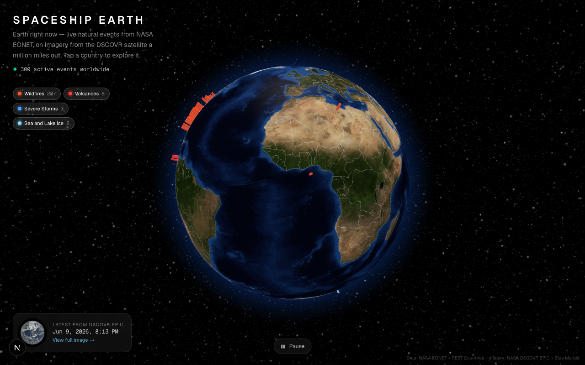

# Spaceship Earth

**Live:** https://nasamate.100dayaichallenge.com

A full-screen, interactive 3D globe showing our planet right now — live natural events, real satellite imagery, and a tappable world atlas, all from NASA and open data.

Day 12 of a [100-day AI build challenge](https://www.100dayaichallenge.com/share/savion).

## What it does

Spin the globe, and you're looking at Earth as a living system:

- **Live natural events** — wildfires, storms, volcanoes, and sea ice from NASA's [EONET](https://eonet.gsfc.nasa.gov/) feed, plotted at their real coordinates and color-coded by category. Filter by type with the chips.
- **Click any event** for its details, plus a **real satellite view** of that exact spot from NASA [GIBS / Worldview](https://worldview.earthdata.nasa.gov/) — with a thermal-anomaly fire overlay for wildfires and volcanoes — and a link into the full Worldview viewer.
- **Tap any country** to open its profile: flag, capital, population, area, currencies, languages, calling code, timezones, driving side, government type, and memberships (EU, UN, NATO, G20…). Powered by [REST Countries](https://restcountries.com/).
- **Earth today** — the most recent full-disc photograph of Earth from NASA's DSCOVR [EPIC](https://epic.gsfc.nasa.gov/) camera, a million miles out.
- **Natural controls** — drag to spin, scroll to zoom, hover a pin to pause-and-aim, or pause rotation entirely.

Data freshness is shown honestly: events are labeled "last observed" (open in EONET ≠ happening this second), and EPIC imagery is the latest NASA has published (it lags a few days by nature).

## Screenshot



## Install

```bash
git clone https://github.com/Still-InFrame/day-12-nasamate.git
cd day-12-nasamate
npm install
npm run dev
```

Then open http://localhost:3000.

### API keys

Create a `.env.local` with:

```
NASA_API_KEY=your_key        # free at https://api.nasa.gov (falls back to DEMO_KEY)
COUNTRIES_API_KEY=your_key   # free at https://restcountries.com/sign-up
```

EONET, GIBS, the Blue Marble texture, and the country borders need no key. The
NASA key is only used for EPIC imagery (a `DEMO_KEY` fallback works but is rate-
limited); the REST Countries key powers the country atlas. Both are read server-
side only and never reach the browser.

## Stack

Next.js (App Router) · TypeScript · Tailwind CSS · [react-globe.gl](https://github.com/vasturiano/react-globe.gl) (Three.js) · world-atlas TopoJSON · NASA EONET / EPIC / GIBS · REST Countries.
